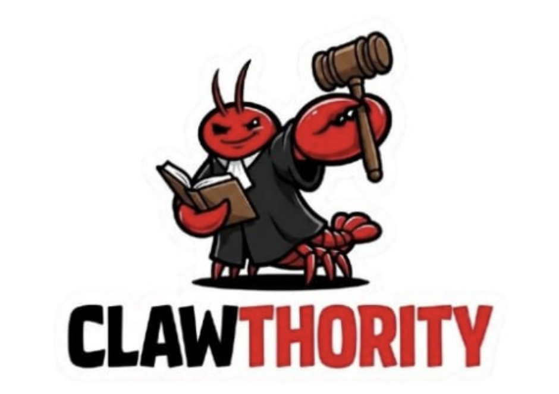

<p align="center">
  
</p>

# Clawthority

[](https://github.com/openclaw/openclaw)
[](https://github.com/OpenAuthority/clawthority/actions/workflows/e2e.yml)
[](package.json)
[](LICENSE)
[](https://nodejs.org)
[](https://www.typescriptlang.org/)
[](docs/contributing.md)

**A semantic authorization runtime for AI agents. Define what your agent can do, enforce it at the boundary, and keep a human in the loop for what matters.**

Clawthority is a policy engine plugin for [OpenClaw](https://github.com/openclaw/openclaw). It sits between your AI agent and every tool it calls, evaluates rules *before* execution, and — if policy says no — the call is never placed.

```
Agent tool call  ─►  Clawthority  ─►  Allow  │  Deny  │  Ask human  ─►  Audit log
```

> [!NOTE]
> **v1.x — stable API.** The plugin API and policy bundle schema follow [semantic versioning](https://semver.org); breaking changes ship in a future major release. The version badge above reflects the current release (1.2.0).

---

## Contents

- [Why Clawthority](#why-clawthority)
- [What it is — and isn't](#what-it-is--and-isnt)
- [Quickstart](#quickstart)
- [How it works](#how-it-works)
- [Action registry](#action-registry)
- [Human-in-the-loop](#human-in-the-loop)
- [Configuration](#configuration)
- [Documentation](#documentation)
- [Development](#development)
- [License](#license)

---

## Why Clawthority

AI agents call tools. When a tool can delete files, send money, or talk to strangers, **who decides whether that call goes through — the model, or you?**

Skill-based safety (instruct the model to "please check first") fails the moment the model is wrong, distracted, or prompt-injected. Clawthority moves the decision **outside the model's loop** — into the code path between the agent and the tool.

| | **The Skill (model-enforced)** | **The Plugin (code-enforced)** |
|---|---|---|
| **Lives in** | Context window — model sees it | Execution path — between agent and tools |
| **Enforces via** | Model reasoning; asks it to comply | Code boundary; intercepts the call |
| **Can be bypassed?** | Yes — prompt injection, loop misfire | No — runs outside the model's loop |
| **Gives you** | Observability + soft stop | Hard enforcement + append-only audit log |

> A skill *asks* the model to enforce. A plugin enforces regardless of what the model decides.

---

## What it is — and isn't

**Clawthority is:**

- A **policy decision + enforcement** layer for tool calls, installed as an OpenClaw plugin.
- A **semantic** authorizer — rules are written against canonical action classes (`filesystem.delete`, `payment.initiate`), not brittle tool-name regexes.
- A **cryptographic capability system** — HITL approvals are SHA-256-bound to `(action_class, target, payload_hash)` at approval time. Param tampering after approval = auto-deny.
- **Two install modes** — `open` (default, implicit permit + critical forbids) for zero-friction installs, and `closed` (implicit deny, explicit permits required) for locked-down production. Stage 1 capability/HITL gates and pipeline-level error handling fail closed in both modes.

**Clawthority isn't:**

- A model-safety or alignment layer. It does not enforce semantic constraints on prompt content, and it does not inspect tool *outputs* for sensitive data.
- A runtime for agents. OpenClaw still decides *which* tools the agent sees; Clawthority decides *whether those calls run*.
- A substitute for good action-class registration. Misregistered tools fall through to `unknown_sensitive_action`, which is a critical forbid in **both** modes — a signal you need to register the alias.

---

## Quickstart

Install as an OpenClaw plugin:

```bash
git clone https://github.com/OpenAuthority/clawthority ~/.openclaw/plugins/clawthority
cd ~/.openclaw/plugins/clawthority
npm install && npm run build
```

Register in `~/.openclaw/config.json`:

```json
{ "plugins": ["clawthority"] }
```

By default Clawthority runs in **`open` mode** — implicit permit, with a critical-forbid safety net (`shell.exec`, `code.execute`, `payment.initiate`, `credential.read`, `credential.write`, `unknown_sensitive_action`). To run in **`closed` mode** (implicit deny, explicit permits required) set the env var before launching your agent:

```bash
export CLAWTHORITY_MODE=closed
```

Mode is read once at activation — restart the agent to change it.

Customise the baseline by dropping hot-reloadable rules into `data/rules.json`:

```json
[
  { "effect": "permit", "action_class": "filesystem.read" },
  { "effect": "forbid", "action_class": "payment.initiate", "priority": 90 },
  { "effect": "forbid", "resource": "tool", "match": "my_custom_tool" }
]
```

Run your agent. A `shell.exec` call now terminates at the boundary:

```
[clawthority] │ DECISION: ✕ BLOCKED (cedar/forbid priority=100 rule=action:shell.exec) — Shell execution is unconditionally forbidden
```

Every block — plus every HITL outcome — is appended to `data/audit.jsonl` as structured JSONL with `stage`, `rule`, `priority`, and `mode` fields. See [docs/troubleshooting.md](docs/troubleshooting.md#total-lockout-recovery) for the recovery runbook.

> [!TIP]
> `data/rules.json` and `hitl-policy.yaml` hot-reload within ~300ms. Anything else under `src/` requires a gateway restart.

---

## How it works

```
Agent picks a tool → Clawthority intercepts
      │
      │  normalize_action(toolName, params) → { action_class, target, payload_hash }
      │  buildEnvelope(...)                  → ExecutionEnvelope
      ▼
┌──────────────────────── Pipeline ────────────────────────┐
│  Stage 1: Capability Gate                                │
│    • low-risk bypass                                     │
│    • approval_required / TTL / payload binding           │
│    • one-time consumption, session scope                 │
│    • untrusted source + high risk → deny                 │
│                                                          │
│  Stage 2: Constraint Enforcement Engine                  │
│    • protected path check (~/.ssh, /etc/, .env, …)       │
│    • trusted domain check (communication.external.send)  │
│    • PolicyEngine.evaluateByActionClass(...)             │
│                                                          │
│  HITL: if required and no valid capability               │
│    → issue approval via Telegram / Slack                 │
│    → deny 'pending_hitl_approval'                        │
└──────────────────────────────────────────────────────────┘
      │
      ├── allow → tool executes
      └── deny  → tool call never placed; ExecutionEvent logged
```

Every decision emits an `ExecutionEvent` to the append-only JSONL audit log with `action_class`, `target`, `decision`, `deny_reason`, `latency_ms`, and `context_hash`.

Full walk-through: [docs/architecture.md](docs/architecture.md).

---

## Action registry

Tool calls are normalized to a canonical action class **before** policy evaluation. You write rules against the class, not the tool name — so aliases, renames, and misspelled parameters all route to the same decision.

| action_class | risk | default HITL | sample aliases |
|---|---|---|---|
| `filesystem.read` | low | none | `read_file`, `cat_file`, `view_file` |
| `filesystem.write` | medium | per_request | `write_file`, `edit_file`, `patch_file` |
| `filesystem.delete` | high | per_request | `rm`, `delete_file`, `unlink`, `shred` |
| `shell.exec` | high | per_request | `exec`, `bash`, `run_command` |
| `communication.email` | high | per_request | `send_email`, `gmail`, `mail` |
| `web.post` | medium | per_request | `http_post`, `axios.post`, `fetch` |
| `payment.initiate` | critical | per_request | `wire_transfer`, `stripe_charge` |
| `credential.write` | critical | per_request | `set_secret`, `keychain_set` |
| `unknown_sensitive_action` | critical | per_request | *fallback for unknown tools* |

**Parameter reclassification** — a `filesystem.write` with a URL target is reclassified to `web.post`; shell metacharacters in `shell.exec` / `filesystem.write` parameters escalate risk to `critical`.

Full table: [docs/action-registry.md](docs/action-registry.md).

---

## Human-in-the-loop

High-risk action classes route to a human for approval via Telegram or Slack. Approvals are:

- **Payload-bound** — SHA-256 of `(action_class | target | payload_hash)` is stored with the approval and re-verified at consumption. Any parameter change invalidates the token.
- **One-time** (`approve_once`) or **session-scoped** (`session`) — session approvals keyed on `${session_id}:${action_class}`.
- **TTL-limited** — default 120 seconds, configurable.
- **UUID v7 IDs** — time-sortable, safe to log.

Example approval message:

```
Action:  communication.external.send
Target:  user@partner.com
Summary: communication.external.send → user@partner.com
Expires: 2026-04-14T12:34:56Z
Token:   01f2e4b8-...
```

Channel setup, retry/backoff, and fallback behaviour: [docs/human-in-the-loop.md](docs/human-in-the-loop.md).

---

## Configuration

Runtime behaviour is configured through three surfaces:

| Surface | Path | Reload |
|---------|------|--------|
| Install mode, feature flags, HITL transport secrets | env vars — `CLAWTHORITY_MODE`, `TELEGRAM_BOT_TOKEN`, `SLACK_BOT_TOKEN`, ... | read at activation; restart to change |
| Policy rules (action-class or resource/match) | `data/rules.json` | hot-reload via watcher (~300ms) |
| Human-in-the-loop approval routing | `hitl-policy.yaml` | hot-reload via watcher (~300ms) |

Structured decisions land in `data/audit.jsonl` — each block carries `stage`, `rule`, `priority`, and `mode` fields for post-mortem analysis.

Full schema and environment-variable overrides: [docs/configuration.md](docs/configuration.md). Recovery runbook for lockouts: [docs/troubleshooting.md](docs/troubleshooting.md#total-lockout-recovery).

---

## Documentation

**Getting started**
- [Installation](docs/installation.md) — prerequisites, plugin registration, first run
- [Configuration](docs/configuration.md) — full schema, env-var overrides, secrets handling
- [Usage](docs/usage.md) — common rule patterns and day-to-day operation

**Architecture & reference**
- [Architecture](docs/architecture.md) — `ExecutionEnvelope`, two-stage pipeline, adapter layer
- [Action Registry](docs/action-registry.md) — all canonical action classes, risk tiers, HITL modes
- [Human-in-the-Loop](docs/human-in-the-loop.md) — payload binding, session vs approve-once, channel adapters
- [API Reference](docs/api.md) — target spec for the dashboard / control-plane REST + SSE surface

**Operations**
- [Rule Deletion](docs/rule-deletion.md) — safe rule removal via the impact-preview modal
- [Troubleshooting](docs/troubleshooting.md) — common errors, log prefixes, fail-closed diagnostics
- [Roadmap](docs/roadmap.md) — what's shipped, what's next
- [Security Review](docs/security-review.md) — enforcement gate findings and pre-implementation requirements for `unsafe_legacy` and CS-11

**Contributing**
- [Contributing guide](docs/contributing.md) — dev setup, test layout, commit conventions

---

## Development

```bash
npm install
npm run dev          # watch mode
npm run build        # production build
npm test             # unit tests
npm run test:e2e     # end-to-end tests
```

---

## License

[Apache-2.0](LICENSE).
